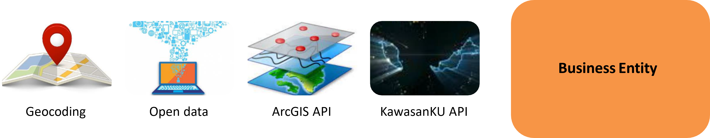
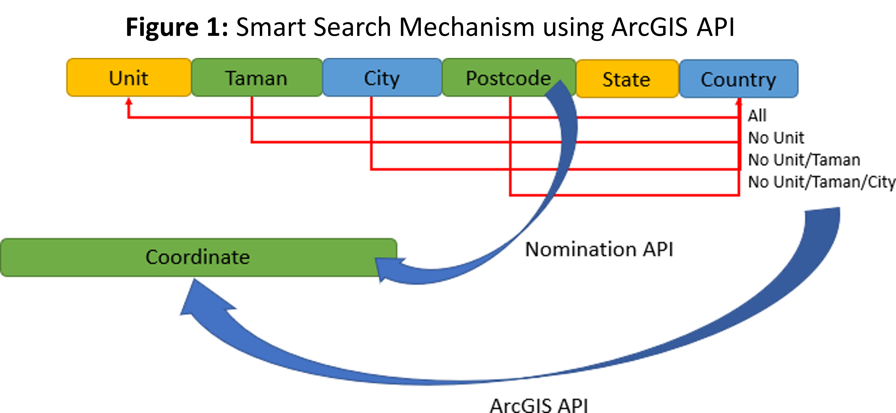
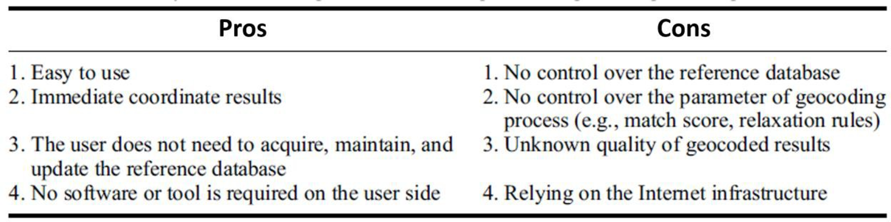
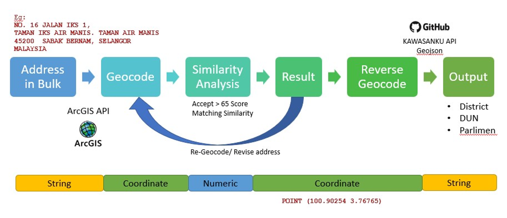
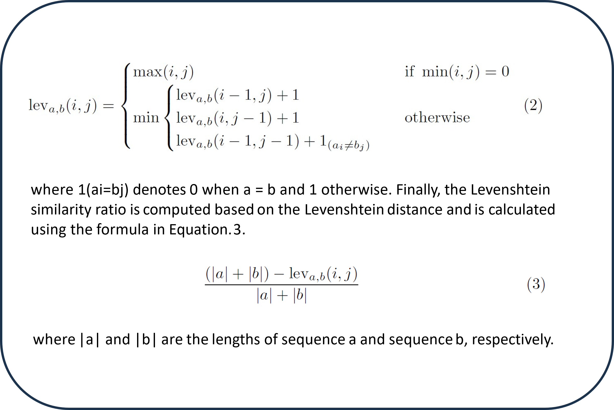
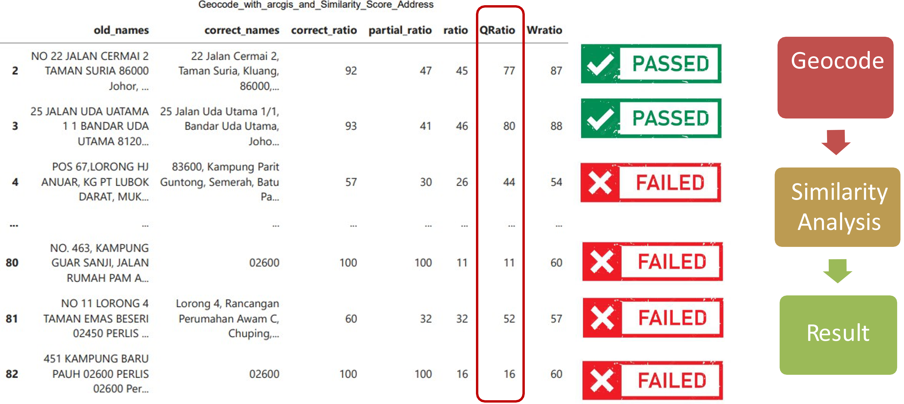
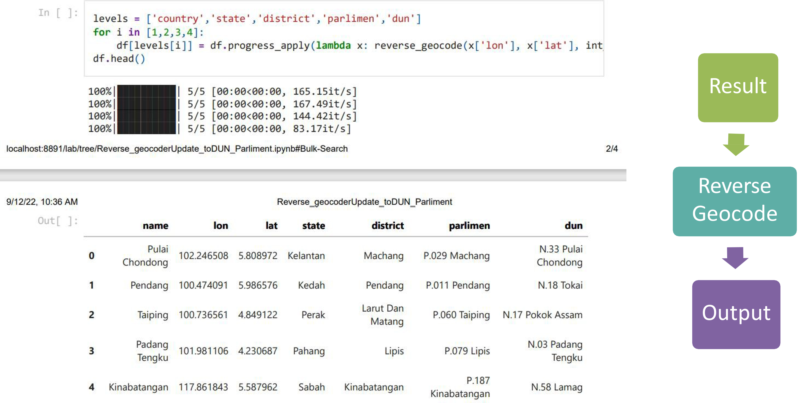
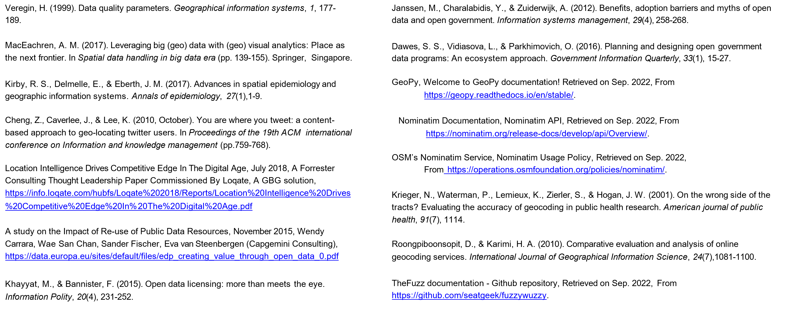
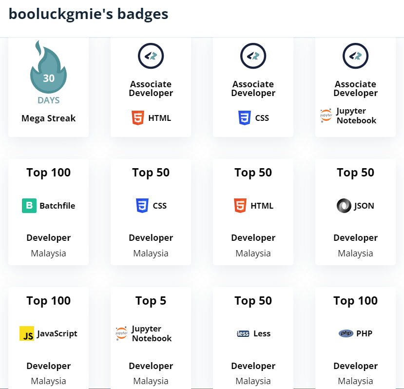

[comment]: # (This presentation was made with markdown-slides)
[comment]: # (This is a CommonMark compliant comment. It will not be included in the presentation.)
[comment]: # (Compile this presentation with the command below)
[comment]: # (mdslides presentation.md --include media)

[comment]: # (Set the theme:)
[comment]: # (THEME = white)
[comment]: # (CODE_THEME = base16/zenburn)
[comment]: # (The list of themes is at https://revealjs.com/themes/)
[comment]: # (The list of code themes is at https://highlightjs.org/)

[comment]: # "You can also use quotes instead of parenthesis"
[comment]: # 'Single quotes work too'
[comment]: # "THEME = white"

[comment]: # (Pass optional settings to reveal.js:)
[comment]: # (controls: true)
[comment]: # (keyboard: true)
[comment]: # (markdown: { smartypants: true })
[comment]: # (hash: false)
[comment]: # (respondToHashChanges: false)
[comment]: # (Other settings are documented at https://revealjs.com/config/)


[comment]: # (Other background options: https://revealjs.com/backgrounds/)

### Application of seamless hybrid geocoding solution for business location using #KAWASANKU API

<span style="font-family: Arial; font-size: 0.6em; display: block; margin-bottom: 10px;">
  **Ahmad Najmi ARIFFIN**, Mohamad Hamizan ABDULLAH<br>
  Core Team Big Data Analytics (CTADR), Department of Statistics, Malaysia
</span>


[comment]: # (!!! data-background-video="media/video.mp4", data-background-video-loop data-background-video-muted data-background-opacity="0.2")

## Problem Statement


<span style="font-family:Arial; font-size:0.6em;display: block; margin-bottom: 12px;">The purpose of our study was **to verify the distributions of geocode location** to consider when analysing geocoded address data, as well as to develop methods for **enriching demographic databases and representing multiple levels** -  district, parliament, and state legislative assembly (Malay: Dewan Undangan Negeri, DUN) - using public repository **KAWASANKU API from Github platform**.</span>


[comment]: # (!!!)

## Introduction & Outline

1. Benefits of Geocoding and **Structuring Address**

[comment]: # (!!! data-auto-animate)

## Introduction & Outline

1. Benefits of Geocoding and **Structuring Address**
2. **Advantages of geocoding** for businesses

[comment]: # (!!! data-auto-animate)

## Introduction & Outline

1. Benefits of Geocoding and **Structuring Address**
2. **Advantages of geocoding** for businesses
3. Availability of **open data** for business research

[comment]: # (!!! data-auto-animate)

API Mechanism using ArcGIS API


[comment]: # (!!!)

A summary of the **pros and cons** <br>of utilising online geocoding services.


[comment]: # (!!!)

## Methodology

----------

[comment]: # (!!!)

Installation of the "geopy" library in Python .
```python [1-2|4-5|8]
    pip install geopy geopandas
    from geopy.geocoders import ArcGIS
    
    # Create a geolocator object using ArcGIS
    geolocator = ArcGIS()
    
    # Example: Geocode an address
    location = geolocator.geocode("1600 Amphitheatre Parkway, Mountain View, CA")
```

[comment]: # (!!! data-background-color="aquamarine")

Workflow for **Geocoding** Address and **Reverse Geocode**.


[comment]: # (!!!)

Output for Geocoding Address and Reverse Geocode.

```python [1|3]
    geocoded_gdf = geocode(string=df['full_address], provider='argis')

    print(geocoded_gdf)
```
[comment]: # (!!!)

Installation of the "fuzzywuzzy" library in Python .
```python [1|3-4|6-7]
    pip install fuzzywuzzy python-Levenshtein -qq
    
    from fuzzywuzzy import fuzz
    from fuzzywuzzy import process
    
    fuzz.ratio('DOSM Malaysia', 'Malaysia DOSM')
    50
```

[comment]: # (!!! data-background-color="aquamarine")

Levenshtein  similarity ratio.


[comment]: # (!!!)

## Result/Output

----------

[comment]: # (!!!)

Geocode Validation.


[comment]: # (!!!)

Similarity analysis.

<span style="font-size:0.6em;display: block; margin-bottom: 12px;">Fuzzy matching analysis, Q-Ratio Score as Similarity Indicator.</span>

[comment]: # (!!!)

Optimisation - Data Enrichment.

<span style="font-size:0.6em;display: block; margin-bottom: 12px;">KAWASANKU API Matching .</span>

[comment]: # (!!!)

Press down on your keyboard or swipe down.

[comment]: # (|||)

## DEMOSTRATION STEP BY STEP

----------
[Google Colab](https://colab.research.google.com/github/booluckgmie/podac/blob/main/Geocode_with_arcgis_and_Similarity_Score_Address.ipynb)

[comment]: # (!!!)

### 4. Discussion and Conclusion

- **Seamless Workflow Framework:**
Aims to suggest a workflow that is seamless and less-dependent.

- **Increased Open Data Benefits:**
Advocacy from both private industry and public agencies for Open Data sharing can enhance the benefits of Open Data.
Fosters a thriving open data ecosystem.

[comment]: # (!!!)

### 4. Discussion and Conclusion

- **Government Geospatial Planning:**   
Federal and state levels of government can utilize a geospatial approach for planning. Enhances strategies to support new uncertainty business entities.

- **Entrepreneurial Business Location Planning:**
Utilizing a map to plan a more advantageous location for an entrepreneur's business based on the distribution network.

[comment]: # (!!!)

### 4. Discussion and Conclusion

- **Geographical Distribution Measurement:**
Measuring the geographical distribution of economic activity is crucial for scientific research and policy formation.


[comment]: # (!!!)

### 5. Limitation

- Unstructured address data is a **common obstacle**.
- Geocoding API's address geocoding has **significantly higher latency** and produces **less accurate results for incomplete** or ambiguous queries;
- Not recommended for real-time user input-  responsive applications.
- In the **future, we plan to employ better model** in order to comprehend the qualitative similarities  between two datasets more thoroughly.

[comment]: # (!!!)

References.


[comment]: # (!!!)
<center><a href="https://profile.codersrank.io/user/booluckgmie">
  
</a></center>

Thanks [@najmiariffin](https://github.com/booluckgmie/podac/blob/main/Geocode_with_arcgis_and_Similarity_Score_Address.ipynb)


[comment]: # (|||)


